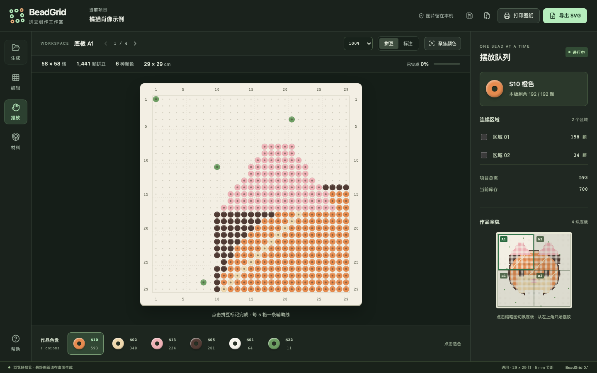

# BeadGrid

BeadGrid 是一款离线桌面拼豆图纸工作台。导入图片后，它会生成限定色数的拼豆图，并把实际制作所需的信息集中到同一套工作流中：分板坐标、色号、用量、库存缺口、连通色块施工清单，以及可打印图纸。

[项目主页](https://hanqing.github.io/PerlerBeads/) · [下载 macOS 版](https://github.com/Hanqing/PerlerBeads/releases/latest) · [查看源码](https://github.com/Hanqing/PerlerBeads)

## 已实现

- 图片拖放/选择，支持 `cover`、`contain`、`stretch` 三种取样方式
- 线性光空间面积取样、Lab 色彩转换和 CIEDE2000 色差匹配
- 全局限定色板、Floyd–Steinberg 抖动、孤立像素清理
- 按库存余量重新分配临界颜色并提示缺料
- 通用 Midi、Hama Midi / Mini / Maxi、Perler 与 Artkal 大方板设备预设
- 按设备自动设置 29×29 / 57×57 / 16×16 分板、钉距、物理尺寸与全局行列坐标
- 单格换色、颜色聚焦、连通色块施工队列与完成状态
- 圆孔拼豆 / 格内标注双视图、100%–300% 缩放、可点击的分板缩略图
- 全启用色盘画笔、最近 100 步撤销 / 重做、方向键与回车操作画板
- 修改库存即时重算缺料；改色自动清除该格完成标记，撤销时恢复
- 物料清单 CSV、工程 JSON、带坐标完整图纸 SVG
- 分板打印布局、四边全局坐标、逐格实际色号/简写切换、材料总表和 50 mm 校准尺，可由系统打印为 PDF
- 无网络也能完成生成和导出；图像处理在本机 Rust 核心中进行

内置色板用于界面和流程验证，颜色值是屏幕近似值。正式生产前应替换为目标品牌实物色卡的测量值，并在导出的图纸中标注品牌与色板版本。



[欢迎页预览](docs/screenshots/studio-welcome.png) · [本轮实现与设计审查](docs/review-2026-09-12.md)

## 开发运行

需要 Node.js、pnpm、Rust stable，以及 Tauri 2 对应的平台开发依赖。

```bash
pnpm install
pnpm tauri dev
```

只运行浏览器界面时可使用：

```bash
pnpm dev
```

浏览器模式包含一个轻量预览算法，不执行库存替代、抖动和零散点清理；界面会持续标明此限制。桌面应用会调用 Rust 生成核心，结果以桌面版本为准。

项目主页位于 `site/`，本地预览使用：

```bash
pnpm site:dev
```

## 验证与构建

```bash
pnpm test # 前端回归测试，需要 Bun 1.3+
pnpm build
cargo test --manifest-path src-tauri/Cargo.toml
pnpm tauri build
```

前端测试无额外 npm 测试依赖，使用 Bun 自带测试运行器。若安装了 gstack browse，可在新浏览器会话打开本地应用后运行 `browse eval tests/ui-smoke.browser.js`，验证导入、库存、编辑、施工、缩放等 24 项界面断言。

## 工程结构

- `src/App.tsx`：方案 C 的工作台界面与交互状态
- `src/components/BoardCanvas.tsx`：高性能画布网格、坐标和施工标记
- `src/components/PatternPreview.tsx`：作品全貌与可交互分板导航
- `src/lib/settings.ts`：尺寸边界、偏好与色板数据校验
- `src/components/PrintSheet.tsx`：材料页与分板打印页
- `src/lib/export.ts`：SVG、CSV、JSON 导出
- `src/data/devices.ts`：设备规格、单板格数与钉距预设
- `src-tauri/src/generator.rs`：图片取样、配色、抖动、库存约束与结果统计
- `src-tauri/src/types.rs`：前后端传输的数据结构
- `refs/`：实物照片、设备调研、官方图纸入口与 1:1 空白底板模板

## 当前版本边界

- 色板是可编辑的启动数据，尚未内置任何品牌的官方色值
- 工程 JSON 可导出用于留档，暂未提供再次导入
- 图案和施工进度暂不自动恢复；偏好与库存自动保存在本机，关闭前请导出 JSON 留档
- PDF 通过系统打印对话框生成，以便保留用户选择纸张、边距和打印机的能力
