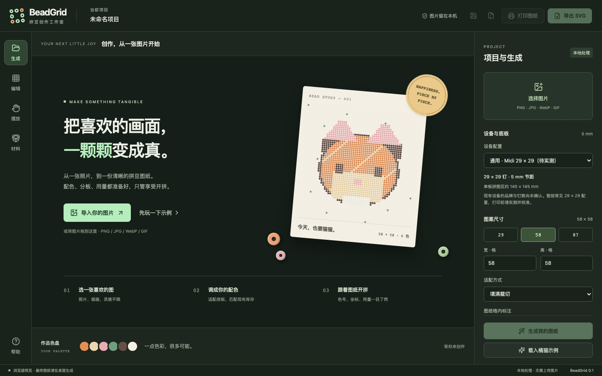

# BeadGrid 实现与设计审查

日期：2026-09-12。范围：现有方案 C 桌面工作台、图片导入、编辑 / 施工状态、设备参数、导出与参考模板。官网 `site/` 本轮未改动。

## 结果

保留左侧工具栏、中央画板、右侧检查面板的专业工作台结构。以深绿灰背景、暖白底板和薄荷绿操作色建立统一视觉层次；欢迎页使用实际示例算法绘制的拼豆作品，不依赖远程图片或字体。

| 审查项 | 原实现 | 已完成调整 |
| --- | --- | --- |
| 库存一致性 | 变更库存后，材料数量和缺口仍是生成时的快照 | 即时重算用量、缺口和购买袋数，并清除旧库存警告 |
| 尺寸边界 | 输入允许超大 / 小数，Maxi 切 Mini 可超过 300 格 | 整数校验、8–300 格限制；设备切换保持合法整板尺寸 |
| 偏好恢复 | 非空数组就当作有效色板 | 校验色值、RGB、库存和袋装量，坏数据回退默认值；存储失败提示 |
| 导入竞争 | 多次导入可能被旧请求覆盖，失败后项目名与画板不一致 | 请求序号保护；成功后才替换原图与名称；同一文件可重复导入 |
| 施工操作 | 聚焦按钮无效，队列只显示前 8 区域 | 可开关聚焦；完整可滚动队列，验证了 225 个独立区域 |
| 编辑操作 | 只能选择图案中已有颜色；改色后保留旧完成标记 | 所有启用颜色可选；100 步撤销 / 重做；完成状态随编辑恢复 |
| 模式边界 | 项目和库存视图点击画板也会更改进度 | 预览只读；仅摆放 / 编辑模式可操作；支持键盘 |
| 演示设备 | 示例固定 58×58、5 mm，忽略设备选择 | 按当前尺寸、底板和节距绘制示例 |
| 生成限制提示 | 重算丢失浏览器简化算法警告 | 保留引擎提示；状态栏持续区分浏览器预览与桌面引擎 |
| 画板辨识度 | 灰色方格、仅两侧坐标，缺乏全貌导航 | 圆孔材质、暖白底板、四侧坐标、色号视图、缩放与分板缩略图 |
| 控件语义 | 无效导出 / 帮助 / 重置操作仍可点击 | 无图案时禁用导出，帮助对话框可用，无原图时禁用重生成 |
| 导出细节 | 深色色标上的文字不易辨认 | 统一按背景亮度选择深 / 浅字色 |
| 实尺模板 | 网格从坐标 0 开始，底板从坐标 8 开始 | 三份空白 SVG 网格与底板起点对齐，避免首格截断 |
| 渲染开销 | 标记施工进度时重复渲染隐藏打印页 | 缓存打印组件，连通区域按图案 / 颜色 / 底板缓存 |

## 视觉约束

- 操作色 `#B6EDBD`，主面板 `#202822`，画板 `#F3EFE4`；警告使用暖黄。
- 圆孔拼豆用于作品、画板和色盘，统一材质语言；网格和坐标保留施工精度。
- 主操作使用有文字的按钮；辅助按钮提供名称、禁用状态、焦点轮廓。
- 信息按“当前底板 → 全局尺寸与进度 → 当前颜色与区域 → 作品全貌”组织。
- 保持桌面最小 1040×700，面板与队列独立滚动；高密度图纸可放大至 300%。
- 动画限于短暂状态反馈，遵守减少动态效果偏好。

## 验证记录

- `pnpm test`：14 项测试通过，3,085 次断言；覆盖尺寸、设备、库存、警告、色板、分板、导出与模板对齐。
- `cargo test --manifest-path src-tauri/Cargo.toml`：3 项 Rust 测试通过。
- `pnpm build`：TypeScript 与生产构建通过。
- `tests/ui-smoke.browser.js`：24 项交互断言，在 1440×900 和 1040×700 均通过，浏览器无控制台错误。
- 实际查看欢迎页、施工画板、200% 标注视图、225 区域队列及最小窗口截图。100% 下画板和说明完整落在可视区域，无窗口横向溢出。
- `pnpm tauri build --bundles app`：macOS `.app` 构建成功，启动后确认进程存在。
- 原生窗口的视觉与交互检查受 Mac 锁屏阻挡，未声称完成原生端到端验证；本轮未做实体打印尺寸校准。

## 仍需注意

- Starter 色号不对应实体品牌，屏幕颜色不应作为采购或最终颜色验收依据。
- 现有设备照片不能确认精确钉数和品牌；通用 29×29 配置仍需实测。
- 工程 JSON 仅导出留档，暂不支持导入；图案和施工进度不跨重启自动恢复。
- 本轮没有改写 Rust 配色算法，也没有把浏览器预览提升为与桌面完全等价的生成引擎。
- 本轮改动保存在本地 Git 分支，未推送 GitHub，也未更新官网部署。

## 界面

